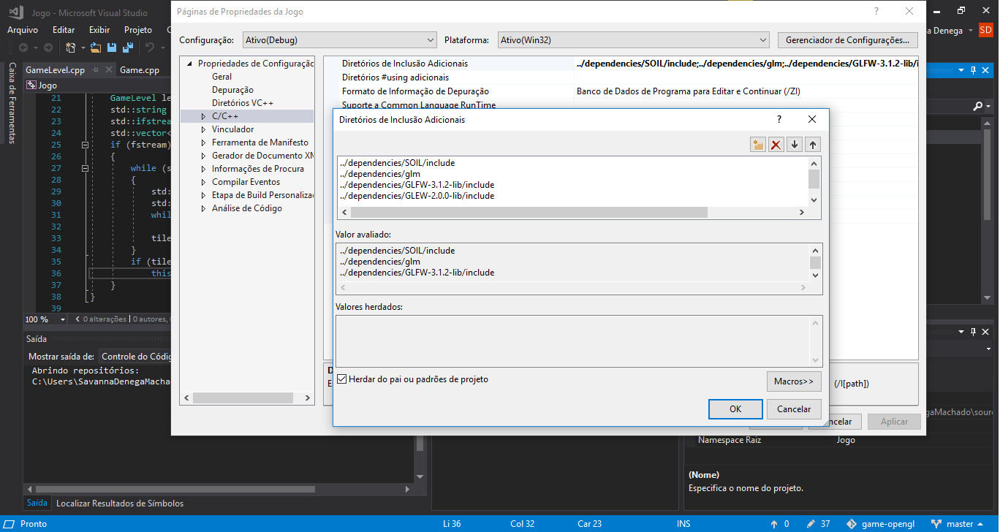
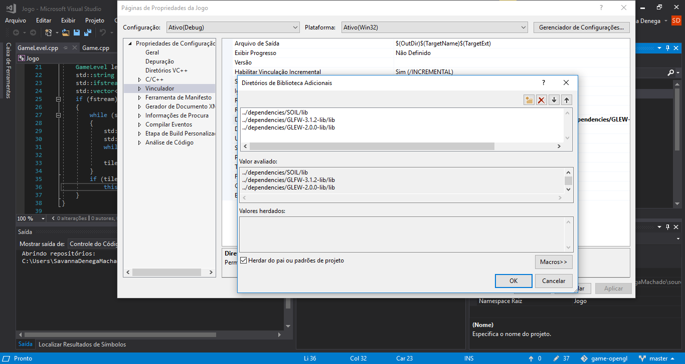
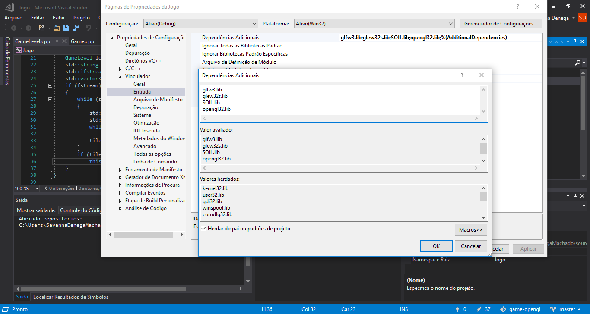

# game-opengl-isometric
Projeto de um game modelo isométrico, destinado para realização do trabalho da disciplina de Processamento Gráfico, Unisinos 2018-1.

Alunos: Pablo; Savanna.

### Recursos utilizados

- C++
- Modern OpenGL
- Programa Visual Studio 2017
- Demais bibliotecas usadas com OpenGL (consultar código)

------------------------------------------------------------------------------------------------------------------

Como configurar o ambiente:

- Faça clone do projeto;
- Depure o projeto para verificar se a versao do core está de acordo como o modelo de seu computador, caso apareça erro de shader, modifique o número versão do core na primeira linha dos arquivos `sprite.frag` e `sprite.vs`, para uma inferior, exemplo: `#version 400 core`, ou menor;
- Caso tenha problema com as dependências, logo depois ao abrir o projeto no VS, faça a configuração do diretório das dependencias em:

  - Propriedades > C/C++ > Diretórios de Inclusão Adicionais > ... Adiciocione os diretórios `GLEW/include` e `GLFW/include`, e `/glm` da pasta `/dependencies` deste projeto;
  	
  
  - Propriedades > Vinculador > Diretórios de Biblioteca Adicionais > ... Adiciocione os diretórios `GLEW/lib` e `GLFW/lib` da pasta `/dependencies` deste projeto.
  
  
  - Erros de adição de lib, vá em Propriedades > Vinculador > Entrada > adicionar os reais nomes das libs (sem vírgula, apenas com entrer entre os nomes)
  
  
* Obs.: As propriedades do projeto já estão setadas para localizar e determinar as dependências nos diretórios acima, porém caso apareçam alguns erros, use as dicas.
